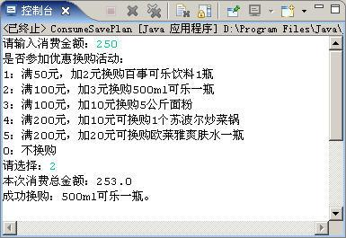

# Java分支循环流程控制

==========================================


* 分支语句——if (else), switch--case

* 循环结构

  * while
    * 特点：先判断，再执行 
  * do...while
    * 特点：先执行，再判断
  * 初始情况不满足循环条件时
    * while循环一次都不会执行
    * do-while循环不管任何情况都至少执行一次
  * for
    * for循环的执行顺序
      * 参数初始化
      * 条件判断
      * 循环操作
      * 更新循环变量

* 流程控制

  * break：改变程序控制流
    * 用于do-while、while、for中时，可跳出循环而执行循环后面的语句
  * continue ：
    * 只能用在循环里continue 作用：
    * 跳过循环体中剩余的语句而执行下一次循环

* 代码案例

  * if语句课件案例

    ```
    import java.util.Scanner;

    /**
     * Created by Administrator on 2016/9/30.
     */
    public class ExampleTest {
        public static void main(String[] args){

           //多条件if语句
            Scanner java = new Scanner (System.in);
            Scanner music = new Scanner (System.in);
            System.out.print("输入张浩的JAVA成绩：");
            int score_java=java.nextInt();
            System.out.print("输入张浩的MUSIC成绩：");
            int score_music=music.nextInt();
            if((score_java>98&&score_music>80)||(score_java==100&&score_music>70)){
                System.out.println("老师说：不错，奖励一个MP4");
            }

            //用户输入两个数a、b。如果a能被b整除 或 a加b大于1000，则输   出a；否则输出b；
            Scanner number1 = new Scanner (System.in);
            Scanner number2 = new Scanner (System.in);
            System.out.print("输入数字a：");
            int a=number1.nextInt();
            System.out.print("输入数字b：");
            int b=number2.nextInt();
            if((a%b==0)||(a+b>1000)){
                System.out.println("输出数字a:" +a);
            }
            else{
                System.out.println("输出数字b：" +b);
            }
        }
    }
    ```

  * if语句课后练习

    ```
    import java.util.Scanner;

    /**
     * Created by Administrator on 2016/9/30.
     */
    public class ExampleTest {
        public static void main(String[] args){

            //设定年龄和性别变量(age和sex)，
            // 如果年龄够7岁，或者年龄够5岁并且性别是’男’，就可以搬动桌子;
            Scanner number1 = new Scanner (System.in);
            Scanner number2 = new Scanner (System.in);
            System.out.print("输入年龄：");
            int age=number1.nextInt();
            System.out.print("输入性别：");
            String sex=number2.next();
            if((age>=7)||(age>=5&&(sex=="男"))){
                System.out.println("他能够搬动桌子");
            }

            //设定个数变量(number)用来保存奶奶买的坏鸡蛋数量,
            // 如果数量小于5个的话就输出”忍了! 吃掉算了!”，否则输出”退货”
            Scanner index = new Scanner (System.in);
            System.out.print("输入坏鸡蛋数量：");
            int number=index.nextInt();
            if(number < 5){
                System.out.println("忍了！吃掉算了！");
            }
            else{
                System.out.println("退货");
            }

            //从键盘输入一个整数，判断是否能被3或者被5整除。
            // 能的话输出：“该数是3或5的倍数”，
            // 否则输出：“该数不能被3或5中的任何一个数整除”
            Scanner number = new Scanner (System.in);
            System.out.print("输入任意整数：");
            int index=number.nextInt();
            if((index%3==0)||(index%5==0)){
                System.out.println("该数是3或5的倍数");
            }
            else{
                System.out.println("该数不能被3或5中的任何一个数整除");
            }

            //从键盘分别输入两个数,保存在变量a和b中，
            // 如果a能被b整除或者a加b大于100，则输出a，否则输出b。
            Scanner number1 = new Scanner (System.in);
            Scanner number2 = new Scanner (System.in);
            System.out.print("输入数字a：");
            int a=number1.nextInt();
            System.out.print("输入数字b：");
            int b=number2.nextInt();
            System.out.println(((a%b==0)||(a+b>100))?("输出数字a:" +a): ("输出数字b：" +b));
        }
    }
    ```

  * 多重if

    ```
    import java.util.Scanner;

    /**
     * Created by Administrator on 2016/9/30.
     */
    public class ExampleTest {
        public static void main(String[] args){

            //多重if
            Scanner grade = new Scanner (System.in);
            System.out.print("输入结业考试成绩");
            int score = grade.nextInt();
            if(score>=90){
                System.out.println("优秀");
            }
            else if(score>=80){
                System.out.println("良好");
            }
            else if(score>=60){
                System.out.println("中等");
            }
            else {
                System.out.println("差");
            }
            
            
            //我想买车，买什么车决定于我在银行有多少存款
            //如果我的存款超过500万，我就买凯迪拉克
            //否则，如果我的存款超过100万，我就买帕萨特
            //否则，如果我的存款超过50万，我就买依兰特
            //否则，如果我的存款超过10万，我就买奥托
            //否则，我买捷安特
            Scanner money = new Scanner (System.in);
            System.out.print("输入银行存款(万)：");
            int number = money.nextInt();
            if(number>500){
                System.out.println("买凯迪拉克");
            }
            else if(number>100){
                System.out.println("买帕萨特");
            }
            else if(number>50){
                System.out.println("买依兰特");
            }
            else if(number>10){
                System.out.println("买奥托");
            }
            else {
                System.out.println("买捷安特");
            }
        }
    }
    ```

  *  嵌套if选择结构

    ```
    import java.util.Scanner;

    /**
     * Created by Administrator on 2016/9/30.
     */
    public class ExampleTest {
        public static void main(String[] args){

            //需求说明：
            //普通顾客购物满100元打9折；会员购物打8折；会员购物满200元打7.5折
            //实现思路：
            //1、外层判断是否是会员
           // 2、内层判断是否达到相应打折要求

            Scanner number = new Scanner (System.in);
            Scanner VIP =new Scanner(System.in);
            System.out.print("请输入消费金额(元)：");
            double money=number.nextDouble();
            System.out.println("请选择：（1）是会员 （2）不是会员");
            int vip=VIP.nextInt();

            if(vip==1) {
                if (money >= 200) {
                    System.out.println("打折后的消费金额为：" + money * 0.75);
                }
                else if (money >= 100) {
                    System.out.println("打折后的消费金额为：" + money * 0.80);
                }
                else {
                    System.out.println("消费金额不足100元，不予以打折。消费金额为："+ money);
                }
            }
            else{
                if (money >= 100) {
                    System.out.println("打折后的消费金额为：" + money * 0.90);
                }
                else {
                    System.out.println("消费金额不足100元，不予以打折。消费金额为：" + money);
                }
            }
        }
    }
    ```

    ```
    import java.util.Scanner;

    /**
     * Created by Administrator on 2016/9/30.
     */
    public class ExampleTest {
        public static void main(String[] args){

    //        从键盘输入您所购买商品的价格和是否为会员以及会员积分
    //        非会员, 9.5折
    //        会员将根据积分的不同享受不同的折扣，输出会员应该获得的折扣
    //        会员将根据积分的不同享受不同的折扣，输出商品打折后的价格
            Scanner money = new Scanner (System.in);
            Scanner VIP =new Scanner(System.in);
            Scanner integral =new Scanner(System.in);
            System.out.print("请输入购买商品的价格(元)：");
            double number=money.nextDouble();
            System.out.println("请选择：（1）会员 （2）非会员");
            int vip=VIP.nextInt();
            if(vip==1) {
                System.out.print("请输入会员积分：");
                int index =integral.nextInt();
                if (index>=8000) {
                    System.out.println("您所购买的商品打6折，折扣后的商品价格为：" + number * 0.60);
                }
                else if (index>=4000) {
                    System.out.println("您所购买的商品打7折，折扣后的商品价格为：" + number * 0.70);
                }
                else if (index>=2000) {
                    System.out.println("您所购买的商品打8折，折扣后的商品价格为：" + number * 0.80);
                }
                else {
                    System.out.println("您所购买的商品打9折，折扣后的商品价格为：" + number * 0.90);
                }
            }
            else{
                System.out.println("您所购买的商品打9.5折，折扣后的商品价格为：" + number * 0.95);
            }
            
            Scanner money = new Scanner (System.in);
            Scanner VIP =new Scanner(System.in);
            Scanner integral =new Scanner(System.in);
            System.out.print("请输入购买商品的价格(元)：");
            double number=money.nextDouble();
            System.out.println("请选择：（1）会员 （2）非会员");
            int vip=VIP.nextInt();
            if(vip==1) {
                System.out.print("请输入会员积分：");
                int index = integral.nextInt() / 2000;
                switch (index) {
                    case 0:
                        System.out.println("您所购买的商品打9折，折扣后的商品价格为：" + number * 0.90);
                        break;
                    case 1:
                        System.out.println("您所购买的商品打8折，折扣后的商品价格为：" + number * 0.80);
                        break;
                    case 2:
                    case 3:
                        System.out.println("您所购买的商品打7折，折扣后的商品价格为：" + number * 0.70);
                        break;
                    default:
                        System.out.println("您所购买的商品打6折，折扣后的商品价格为：" + number * 0.60);
                }
            }
            else{
                System.out.println("您所购买的商品打9.5折，折扣后的商品价格为：" + number * 0.95);
            }
        }
    }
    ```

  * 分支综合练习

    

    ```
    import java.util.Scanner;

    /**
     * Created by Administrator on 2016/9/30.
     */
    public class ExampleTest {
        public static void main(String[] args){

            Scanner money=new Scanner(System.in);
            Scanner huodong=new Scanner(System.in);
            System.out.print("请输入消费金额（元）：");
            double number =money.nextDouble();
            System.out.println("是否参加优惠换购活动：");
            System.out.println("1：满50元，加2元可换购百事可乐饮料1瓶");
            System.out.println("2：满100元，加3元可换购500ml可乐1瓶");
            System.out.println("3：满100元，加10元可换购5公斤面粉");
            System.out.println("4：满200元，加10元可换购1个苏泊尔炒菜锅");
            System.out.println("5：满200元，加20元可换购欧莱雅爽肤水1瓶");
            System.out.println("0：不换购");
            System.out.print("请选择：");
            int index =huodong.nextInt();
            switch (index){
                case 0:System.out.println("本次消费总金额：" +number +"\n不参加换购活动。");
                    break;
                case 1:
                    if(number>=50){
                        System.out.println("本次消费总金额：" +(number+2)+"\n成功换购：百事可乐一瓶");}
                    else {
                        System.out.println("您当前消费金额不能参加该项换购活动。");}
                    break;
                case 2:
                    if(number>=100){
                        System.out.println("本次消费总金额：" +(number+3)+"\n成功换购：500ml可乐一瓶");}
                    else {
                        System.out.println("您当前消费金额不能参加该项换购活动。");}
                    break;
                case 3:
                    if(number>=100){
                        System.out.println("本次消费总金额：" +(number+10)+"\n成功换购：5公斤面粉");}
                    else {
                        System.out.println("您当前消费金额不能参加该项换购活动。");}
                    break;
                case 4:
                    if(number>=200){
                        System.out.println("本次消费总金额：" +(number+10)+"\n成功换购：苏泊尔炒菜锅一个");}
                    else {
                        System.out.println("您当前消费金额不能参加该项换购活动。");}
                    break;
                case 5:
                    if(number>=200){
                        System.out.println("本次消费总金额：" +(number+20)+"\n成功换购：欧莱雅爽肤水一瓶");}
                    else {
                        System.out.println("您当前消费金额不能参加该项换购活动。");}
                    break;
                default:System.out.println("尚未开始其他换购活动");
            }
        }
    }
    ```

  * while 100以内偶数和

    ```
    /**
     * Created by Administrator on 2016/9/30.
     */
    public class ExampleTest {
        public static void main(String[] args){

            int num=0;
            int sum=0;
            while(num<=100){
                sum=sum+num;
                num=num+2;
            }
            System.out.println("100以内（包括100）的偶数之和："+ sum);

        }
    }
    ```