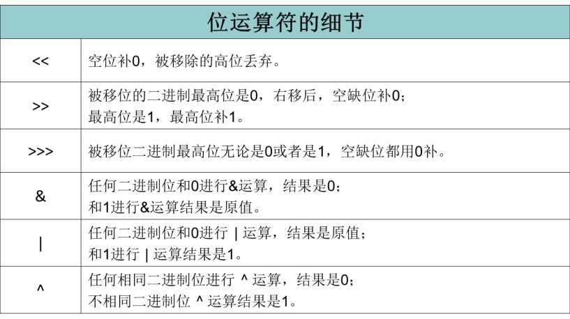

# Java基础(标识符、数据类型、运算符)

=========================================


* Java语言特点：
  * 简单的
  * 面向对象的
  * 动态、健壮、安全的
  * 解释的
  * 与平台无关的
  * 多线程的

* 标识符命名规则：

  * 标识符应以字母,下划线,美元符号开头
  * 标识符应以字母,下划线,美元符号或数字组成
  * 标识符对大小写敏感,长度无限止

* 数据类型：

  * 基本数据类型：(字节)
    * 数值型：
      * 整数类型：byte(1) , short(2) , int(4) , long(8)
      * 浮点类型：float(4) , double(8)
    * 字符型：char(2)
    * 布尔型：boolean(1)
  * 引用数据类型：
    * 类：class
    * 接口：interface
    * 数组：[ ]

* 运算符

  * 赋值运算符

    | =    | +=   | *=   | %=   |
    | ---- | ---- | ---- | ---- |
    |      | -=   | /=   |      |

  * 算术运算符

    | +(正号) | +(加) | *    | %    | ++(前) | ++(后) | +(字符串相加) |
    | ----- | ---- | ---- | ---- | ----- | ----- | -------- |
    | -(负号) | -(减) | /    |      | --(前) | --(后) |          |

    * (后有例子)

  * 关系运算符

    | >    | ==   | >=   |
    | ---- | ---- | ---- |
    | <    | !=   | <=   |

  * 逻辑运算符

    * true 、 false 判断

      | 逻辑运算符      | true-true | true-false | false-true | false-false |
      | ---------- | --------- | ---------- | ---------- | ----------- |
      | &          | true      | false      | false      | false       |
      | \|         | true      | true       | true       | false       |
      | !          |           |            |            |             |
      | ^(XOR异或)   | false     | true       | true       | false       |
      | &&(AND短路)  | true      | false      | false      | false       |
      | \|\|(OR短路) | true      | true       | true       | false       |

    * “&”和“&&”的区别：

      * &&时，如果左边为真，右边参与运算，如果左边为假，右边不参与
      * 运算&时，左边无论真假，右边都进行运算

    * “|”和“||”的区别同理，双或时，左边为真，右边不参与运算

    * 异或( ^ )与或( | )的不同之处是：当左右都为true时，结果为false。

  * 三元运算符

    * 格式
      * (条件表达式)?表达式1：表达式2；
      * 如果条件为true，运算后的结果是表达式1；
      * 如果条件为false，运算后的结果是表达式2；

  * 位运算符

    * | 运算符     | 运算      | 运算符        | 运算   |
      | ------- | ------- | ---------- | ---- |
      | <<(左移)  | >>(右移)  | >>>(无符号右移) | &(与) |
      | \|(或运算) | ^(异或运算) | ~(反码)      |      |

      * 位运算符的细节

        

      * (后有例子)

* 实例：

  *  使用变量存储MP3信息，并打印输出

     ```
     /**
     * Created by Administrator on 2016/9/30.
     */
     public class ExampleTest {
        public static void main(String[] args){

            //变量定义、赋值
            String brand = "爱国者F928";
            float weight = 12.4F;
            String type = "内置锂电池";
            int price = 499;

            //打印
            System.out.println("品牌（brand）:" + brand) ;
            System.out.println( "重量（weight）:" + weight) ;
            System.out.println("电池类型（type）:" + type) ;
            System.out.println("价格（price）:" + price) ;

        }
     }
     ```

  *  根据天数（46）计算周数和剩余的天数

  *  已知圆的半径radius= 1.5，求其面积

     ```
     /**
      * Created by Administrator on 2016/9/30.
      */
     public class ExampleTest {
         public static void main(String[] args){

             //根据天数（46）计算周数和剩余的天数
             int days=46;
             int week=days/7;
             int leftday=days%7;
             System.out.println("周数="+week+"\n"+"剩余天数="+leftday);

             //已知圆的半径radius= 1.5，求其面积
             double r=1.5;
             double S=Math.PI*Math.pow(r,2);
             System.out.println("面积="+S);
             System.out.println("周长="+ 2*Math.PI*r);

         }
     }
     ```

  *   位运算符

     ```
     /**
      * Created by Administrator on 2016/9/30.
      */
     public class ExampleTest {
         public static void main(String[] args){

             System.out.println(3<<2);//12
             System.out.println(3>>1);//1
             System.out.println(1>>>1);//0
             System.out.println(6&3);//2
             System.out.println(6|3);//7
             System.out.println(6^3);//5
             System.out.println(~6);//-7

         }
     }
     ```