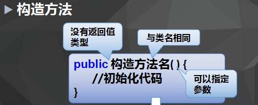

# 类和对象、封装

===================================

* 对象
  * 对象是存在的具体实体，具有明确定义的状态和行为。
  * 对象：用来描述客观事物的一个实体，由一组属性和方法构成
* 对象的特征
  * 属性：
    * 对象具有的各种特征
    * 每个对象的每个属性都拥有特定值
  * 方法：
    * 对象执行的操作
* 类
  * 具有相同属性和方法的一组对象的集合 
  * 类是对象的类型
  * 定义一个类的步骤：
    * 定义类名
    * 编写类的属性
    * 编写类的方法
* 如何创建和使用对象：
  * 使用对象的步骤：
    * 创建对象： 类名 对象名 = new 类名();
  * 引用对象成员：使用“.”进行以下操作
    * 引用类的属性：对象名.属性
    * 引用类的方法：对象名.方法名()
* 从现实中抽象出类分三步：
  * 1.找出它的种类
  * 2.找出它的属性 
  * 3.找出它的行为 
* 
* 方法重载，指同一个类中多个方法：
  * 方法名相同
  * 参数列表不同
* 方法重载：同一个类中，方法名相同，参数项不同（参数类型不同、参数个数不同）
* 封装
  * 封装：将类的某些信息隐藏在类内部，不允许外部程序直接访问，而是通过该类提供的方法来实现对隐藏信息的操作和访问 
  * 封装的步骤：
    * 1.修改属性的可见性 -设为private
    * 2.创建getter/setter方法 -用于属性的读写
    * 3.在getter/setter方法中加入属性控制语句 -对属性值的合法性进行判断 
* this关键字的用法
  * 调用属性
  * 调用方法
  * 调用构造方法（必须是构造方法中的第一条语句）