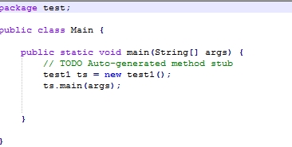

# 2016-09-20工作日报
====================

1.已完成的工作内容

  * (1)父类、子类定义
  
      public abstract class Pet{

	      //共同的属性和方法;
	      
      }//父类
      
      public class Dog extends Pet{
      
	      //子类特有的属性和方法;
	      
      }//子类

  * (2)子类访问父类成员
  
      super.name;//访问父类属性

	super.print();//访问父类方法

  * (3)访问修饰符
  
  |访问修饰符		|本类     	|同包     	|子类     	|其他     |
  |:--------------------|:--------------|:--------------|:--------------|:--------|
  |Private		|可以访问	|	         	         	        
  |(默认)friendly	|可以访问	|可以访问	|        	         
  |Protected		|可以访问	|可以访问 	|可以访问	|      
  |public		|可以访问	|可以访问	|可以访问	|可以访问 |

  * (4)继承后的初始化顺序：父类（属性、方法）——子类（属性、方法）
  
  * (5)抽象类中不一定有抽象方法，抽象方法一定在抽象类中
  
    	public abstract void print(); //父类抽象方法

    	@Override
    	
    	public void print() {
    	
    		// TODO Auto-generated method stub
    		
    	}//子类中实现父类中的抽象方法

  * (6) instanceof运算符
  
    	该运算符用来判断一个对象是否属于一个类或者实现了一个接口，结果为true或false

      	对象 instanceof  类或接口 
      
	      public class Master{
	      
	      	void play(pet pets){
	      	
	      		if(pets instanceof Dog){
	      		
	      			Dog dog = (Dog) pets;
	      			
	                  dog.catchingFlyDisc();
	                  
	      		}
	      		
	      		else{
	      		
	      			Pen pen = (Pen) pets;
	      			
	      			pen.swimming();
	      			
	      		}
	      		
	      	}

  * (7)重写与重载
  
    	重写：子类中定义的方法与父类有相同的名称和参数

    	重载：在类中可以创建多个方法，具有相同的名字，但有不同的参数个数/类型

2.工作成果

  * (1)继承：父类与子类、父类抽象方法 
  
     	

	
	
	
	
	
	
	

  * (2)汽车租赁
  
  	

    	
    	
	
	
	

  * (3)static
  
    	

  * (4)main()函数调用
  
    	

	
	
	

3.未完成的工作

  *
  
4.未完成的原因

  *
  
5.遇到的问题及解决方法

  * 不是所有的类都能够建立父类与子类，条件是要有共同的属性或方法
