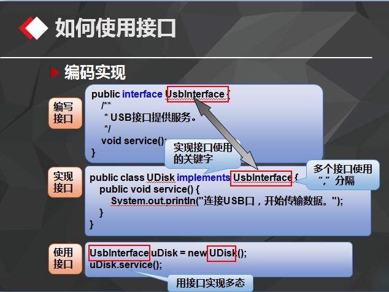
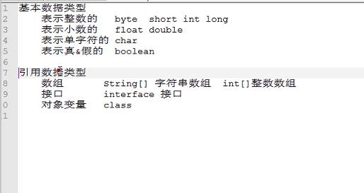

# 2016-09-21工作日报
====================

* 1.已完成的工作内容
  * (1)用github写工作日报
  * (2)多态：指两个或多个属于不同类的对象，对同一个消息（方法调用）作出不同响应的能力

    public abstract void treat();//父类中定义的抽象方法
    @Override
     public void eat() {
     	System.out.println("狗吃骨头");
      }//Dog中实例调用父类的抽象方法
     public void treat(Pet pet) {
     	pet.treat(); 	}//Master中使用
     Dog dog = new Dog(15,65);
     master.treat(dog);//main函数	

* (3)实现多态
  * 使用多态实现思路
    * 编写父类
    * 编写子类，子类重写父类
    * 方法运行时，使用父类的类型，子类的对象
  * 实现多态的步骤：
    * 子类重写父类的方法
    * 两种方式
      * 创建父类变量，实例化子类对象
      * 把父类类型作为参数类型，该子类及子类对象作为参数传入
    * 运行时，根据实际创建的对象决定执行哪个方法

* (4)面向对象的三大特性：封装、继承、多态

* (5)Static(静态)

* 根据类成员变量是否是静态的进行分类可分两种：

  * 一种是被static修饰的变量，叫静态变量或类变量；
  * 另一种是没有被static修饰的变量，叫实例变量。

* ​

  * static对象可以在它的任何对象创建之前访问，无需引用任何对象。
  * 静态方法中不能用this和super关键字，不能直接访问所属类的成员变量和成员方法，只能访问所属类的静态成员变量和成员方法。

* 一般在需要实现以下两个功能时使用静态变量：

  * 在对象之间共享值时
  * 需要更方便访问变量时

* 静态代码块

  * static代码块也叫静态代码块，是在类中独立于类成员的static语句块，可以有多个，位置可以放到类的内部，它不在任何的方法体内
  * JVM加载类时会 执行这些静态的代码块
  * 如果static代码块有多个，JVM将按照它们在类中出现的先后顺序依次执行它们，每个代码块只会被执行一次。
  * Static代码块的执行顺序优先于所在类的构造方法。

* (6)final关键字
  * final关键字可以修饰类、方法、成员变量，final的含义是最终
  * final变量是常量，不能改变
  * final方法不能重写
  * final类不能被继承
* (7)接口的特性(interface------implements)

  * 接口不可以被实例化
  * 实现类必须实现接口的所有方法
  * 实现类可以实现多个接口
  * 接口中的变量都是静态常量

* (8)public class PrintMachine {

    	public void print(InBox box, InPaper paper) {

    		box.color();

    		paper.size();

    	}

    }//父类

    public interface InPaper {

    	public void size();

    }//子类

    public interface InBox {

    	public void color();

    }//子类
* (9)接口代码改错

    public interface MyInterface {

      public MyInterface();//×

      public void method1();//√

      public void method2(){ }//×(抽象，无方法体)

      private void method3();//×(只能用public、protected)

      void method4();//√

      int method5();//√

      int TYPE = 1;//√
    }

* (10)JAVA内存分配涉及的区域：

    寄存器(程序中无法控制)

    栈stack(基本类型的数据和对象的引用)

    堆heap(new产生的数据)

    静态域(用static定义的静态成员)

    常量池(常量)

    非RAM存储(永久存储空间)
* (11) 栈stack

    存放基本类型(8种：byte/short/int/long/float/double/boolean/char)的数据和对象的引用

​    
    先进后出

    当在一段代码块定义一个变量时，Java就在栈中为这个变量分配内存空间，

    当该变量退出该作用域后，Java会自动释放掉为该变量所分配的内存空间，该内存空间可以立即被另作他用。
* (12)方法重写的规则

  * 在继承关系的子类中重写的方法名、参数、返回值类型必须与父类相同

  * 私有方法不能继承因而也无法重写

|      | 位置   | 方法名  | 参数表  | 返回值  | 访问修饰符    |
| ---- | ---- | ---- | ---- | ---- | -------- |
| 方法重写 | 子类   | 相同   | 相同   | 相同   | 不能比父类更严格 |
| 方法重载 | 同类   | 相同   | 相同   | 无关   | 无关       |

* 2.工作成果
* (已在1包含)
* 3.未完成的工作
* ​
* 4.未完成的原因
* ​
* 5.遇到的问题及解决方法
* (1)github网页中表格输入，用Tab,含有空格没法显示表格，所有符号为英文状态
* 表格样式

| 应完成内容       |
| :---------- |
| github写md文件 |

* (2)github中，所有符号、数字应为英文状态，显示换行内容，应用Enter键加空行
* (3) giyhub中插入的图片不显示

	用(https://github.com/yukunqiao/daily/blob/master/images/DataType.jpg)替换(daily/images/DataType.jpg)

	或

	用(images/DataType.jpg)
