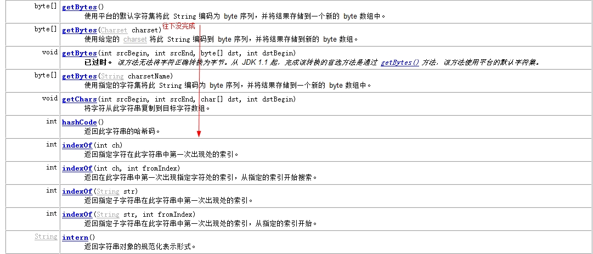

# 2016-09-22工作日报
====================

1.已完成的工作内容

 *(1)String 构造方法
 
 (2)String 方法前半部分

2.工作成果

 *public class StringTest {

    public static void main(String [] arge) throws UnsupportedEncodingException {

        String test1 = new String();

        String original = "String构造方法摘要";
        String test2 = new String(original);
        System.out.println(test2);

        char[] value = {'y','u','k','u','n','q','i','a','o'};
        String test3 = new String(value);
        System.out.println(test3);

        String test4 = new String(value,3,3);
          //截取指定位置和长度的字符(char)
        System.out.println(test4);

        int[] codePoints = {66,67,68,69,70,65};
        String test5 = new String(codePoints,2,3);
          //将该子数组(int)指定位置和长度的的内容转换为 char
        System.out.println(test5);

        byte[] bytes =  {66,67,68,69,70,65};
        String  test6 = new String(bytes);
          //ASCII(byte)
        System.out.println(test6);

        String test7 = new String(bytes,"gb2312");
        System.out.println(test7);

        String test8 = new String(bytes,1,3);
          //截取指定位置和长度的字符(byte)
        System.out.println(test8);

        String test9 = null;
        try {
            test9 = new String(bytes,1,3,"UTF-8");
        } catch (UnsupportedEncodingException e) {
            e.printStackTrace();
        }
        System.out.println(test9);

        String test10 = new String(bytes,1,3,"utf-8");
        System.out.println(test10);

        StringBuffer buffer = new StringBuffer();
        buffer.append("y");
        buffer.append("k");
        buffer.append("q");
        String test11 = new String(buffer);
          //连接字符
        System.out.println(test11);

        StringBuilder builder = new StringBuilder();
        builder.append("y");
        builder.append("k");
        builder.append("q");
        String test12 = new String(builder);
          //连接字符
        System.out.println(test12);
        
        
        String str = "这是String中的构造方法";
        String str1 = "asdfghj";
        String str2 = "jhgfdsa";
        String str3 = "String";
        char[] data = {'S','t','r','i','n','g','E','n','g','l','i','s','h'};
        System.out.println(str.length());
        System.out.println(str.charAt(5));
          //截取字符串中指定位置的字符(起始位置为0，取值范围：0-length()-1)
        System.out.println(str.codePointAt(5));
          //截取字符串中指定位置的字符ASCII码(起始位置为0，取值范围：0-length()-1)
        System.out.println(str.codePointBefore(5));
          //截取字符串中指定位置的字符ASCII码(起始位置为1，取值范围：1-length())
        System.out.println(str.codePointCount(3,10));
          //截取字符串中指定位置的字符数量
        System.out.println(str1.compareTo(str2));
          //按照字典排序对两个字符串进行比较
        System.out.println(str1.compareToIgnoreCase(str2));
          //按照字典排序对两个字符串进行比较
        System.out.println(str1.concat(str2));
          //将指定字符串连接到此字符串的结尾
        System.out.println(str.contains(str3));
          //当且仅当此字符串包含指定的 char 值序列时，返回 true
        System.out.println(str1.contentEquals("asdfghj"));
          // 将此字符串与指定的 StringBuffer 比较。
        System.out.println(str.copyValueOf(data));
          //返回指定数组中表示该字符序列的 String
        System.out.println(str.copyValueOf(data,2,6));
          //返回指定数组中表示该字符序列的 String
        System.out.println(str.endsWith("法"));
          //测试此字符串是否以指定的后缀结束
        System.out.println(str1.equalsIgnoreCase(str2));
          //如果两个字符串的长度相同，并且其中的相应字符都相等（忽略大小写），则认为这两个字符串是相等的。
        byte[] byte1 = str1.getBytes();
          //使用平台的默认字符集将此 String 编码为 byte 序列，并将结果存储到一个新的 byte 数组中。
        System.out.println(byte1);
        
    }
  }
3.未完成的工作

 *(1)String  箭头处往下
 
 
 
 (2)菜鸟教程——java  代码
  
4.未完成的原因

 *
  
5.遇到的问题及解决方法

 * (1)charset
 
    String test9 = new String(bytes,1,3,"UTF-8")//"Alt"+"Enter"
    
  (2)StringBuffer和StringBuilder的区别
  
  (3)字典排序
  
  (4)//public boolean equals(Object anObject)
            
            // 将此字符串与指定的对象比较。
            //当且仅当该参数不为 null，并且是与此对象表示相同字符序列的 String 对象时，结果才为 true。
    
    //static String format(Locale l,String format,Object... args)
    
            // 使用指定的语言环境、格式字符串和参数返回一个格式化字符串。
    
    //static String format(String format,Object... args)
    
            // 使用指定的格式字符串和参数返回一个格式化字符串。
