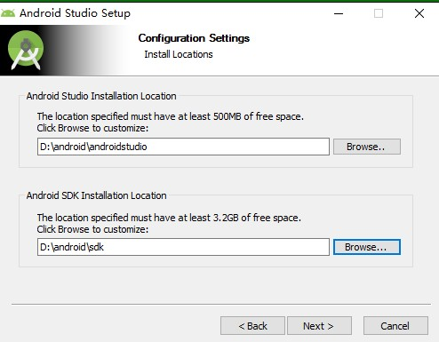
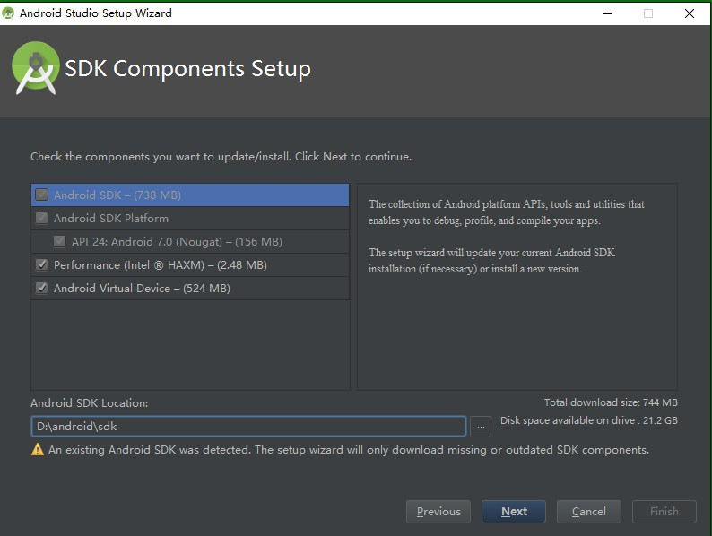
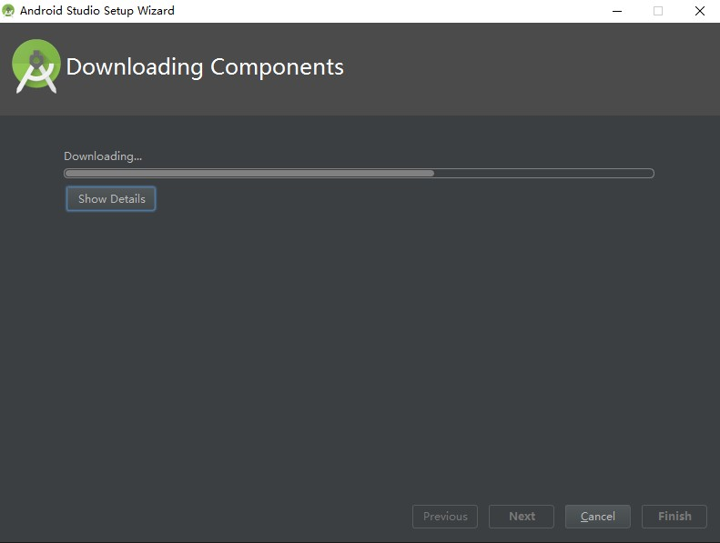
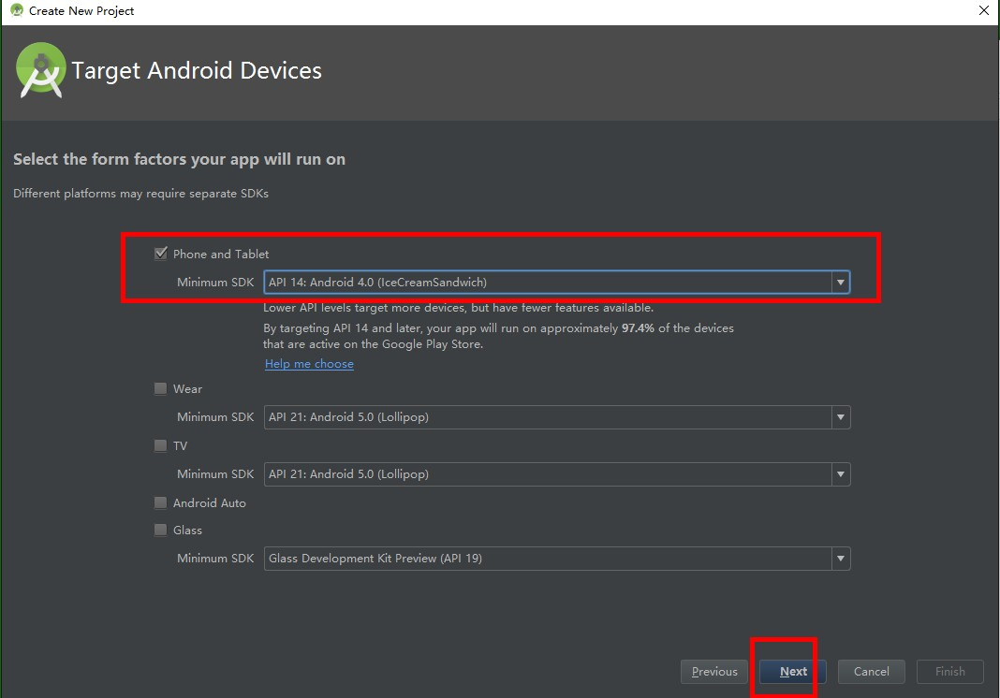

# 2016-10-09工作日报

===============================================

* 2016-10-08 Java测验讲解
  * String 类是final的，这是为了让它不能被继承

  * 对于存储密码而言，为什么使用char数组比使用String要好？

    * (1)由于String在Java中是不可变的，如果你将密码以明文的形式保存成字符串，那么它将一直留在内存中，直到垃圾收集器把它清除。而由于字符串被放在字符串缓冲池中以方便重复使用，所以它就可能在内存中被保留很长时间，而这将导致安全隐患，因为任何能够访问内存(memory dump内存转储)的人都能清晰的看到文本中的密码，这也是为什么你应该总是使用加密的形式而不是明文来保存密码。由于字符串是不可变的，所以没有任何方式可以修改字符串的值，因为每次修改都将产生新的字符串，然而如果你使用char[]来保存密码，你仍然可以将其中所有的元素都设置为空或者零。所以将密码保存到字符数组中很明显的降低了密码被窃取的风险。
    * (2)Java本身也推荐使用JPasswordField组件的getPassword()方法，该方法将返回一个字符数组，而放弃了原来的getText()方法，这个方法把密码以明文的形式返回而可能会引起安全问题。所以，最好能听从来自Java团队的建议并且坚持标准，而不是去反对它。
    * (3)使用字符串，在将文本输出到日志文件或者控制台的时候会存在风险。但是使用数组你不会把数组的内容打印出来，相反，打印出来的是数组在内存中的位置。尽管这算不上一个真正的原因，但这仍然很有意义。

  * 请详细描述抽象类和接口的异同。

    * 相同点：
      * (1) 都可以被继承     
      * (2) 都不能被实例化     
      * (3) 都可以包含方法声明     
      * (4) 派生类必须实现未实现的方法  
    *  区 别：     
      * (1) 抽象基类可以定义字段、属性、方法实现。接口只能定义属性、索引器、事件、和方法声明，不能包含字段。     
      *  (2) 抽象类是一个不完整的类，需要进一步细化，而接口是一个行为规范。
      * (3) 接口可以被多重实现，抽象类只能被单一继承     
      *  (4) 抽象类更多的是定义在一系列紧密相关的类间，而接口大多数是关系疏松但都实现某一功能的类中      
      * (5) 抽象类是从一系列相关对象中抽象出来的概念， 因此反映的是事物的内部共性；接口是为了满足外部调用而定义的一个功能约定， 因此反映的是事物的外部特性     
      *  (6) 接口基本上不具备继承的任何具体特点,它仅仅承诺了能够调用的方法         

  * 详述方法重载和方法重写的异同。

    |      | 位置   | 方法名  | 参数表  | 返回值  | 访问修饰符    |
    | ---- | ---- | ---- | ---- | ---- | -------- |
    | 方法重写 | 子类   | 相同   | 相同   | 相同   | 不能比父类更严格 |
    | 方法重载 | 同类   | 相同   | 相同   | 无关   | 无关       |

* Android Studio的安装说明
  * 1.打开文件，运行文件
    
  * 2.欢迎界面
    
  * 3.选择安装内容
    
  * 4.同意协议
    
  * 5.选择安装目录
    
  * 6.7.8.安装进行中
    
  * 7
    
  * 8
    
  * 9.选择是否保留之前的安装
    
  * 10
    
  * 11.不影响安装
    
  * 12
    
  * 13选择安装模式
    
  * 14界面白或黑
    
  * 15.SDK
    
  * 16
    
  * 17安装完成
    
  * 18打开Android Studio
    
  * 19
    
  * 20Setting
    
  * 21
    
  * 22.Android SDK
    
  * 23.SDK Platformas,选择7.0，6.0，6.1，50，4.4
    
  * 24.SDK Tools
    
  * 25.安装选择的项目
    
  * 26
    
  * 27
    
  * 28
    
  * 29
    
  * 30安装完成
    
  * 31.新建一个项目
    
  * 32.项目名称，Company，包进行修改，修改文件保存目录
    
  * 33
    
  * 34
    
  * 35.Android Devices
    
  * 36.选择Mobile
    
  * 37.命名
    
  * 38
    
  * 39
    
  * 40
    
  * 41设置完毕
    
