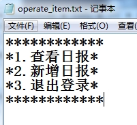
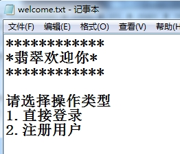

# 2016-10-14日报

* 日报的编程、运行

* operate_item.txt

  

* welcome.txt

  

* Main.java

  package com.feicuiedu;

  import com.feicuiedu.daily.controller.DailyController;
  import com.feicuiedu.daily.controller.UserController;

  import java.util.Scanner;

  /**

  Created by chenyan on 2016/10/10.
   */
  public class Main {

   public static void main(String[] args) {

       Scanner scanner = new Scanner(System.in);
       UserController userController = new UserController(scanner);
       //创建一个userController对象，调用UserController方法
      
       String filePath = "E:\\workspace\\IdeaProjects\\ExampleSet\\Daily\\src\\main\\resources";
       //将页面输出的放在该Module的resources库中，设置filePath = 绝对路径
       String fileName = "welcome.txt";
       //设置fileName = 文件名
       userController.showSelectItem(filePath, fileName);
       //调用UserController的showSelectItem方法读取欢迎界面文件
      
       int selected = userController.selectedItem();
       //选择（登陆or注册）
      
       /*对user进行操作*/
       boolean loginResult = false;
       //布尔值，记录是否登陆成功
       String username = null;
       if (1 == selected) {
           // 登录
           loginResult = userController.login();
       }
       else {
           // 注册
           userController.register();
       }
      
       // 当loginResult==true时，登陆成功。
       if (loginResult) {
           fileName = "operate_item.txt";
           //读取显示登陆后界面的文件
           userController.showSelectItem(filePath, fileName);
           selected = userController.selectedItem();
           //选择（查看日报or新增日报or退出登陆）
      
           /*对daily进行操作*/
           //登陆成功后的操作（1、查看日报，2、新建日报，3、退出）
           DailyController dailyController = new DailyController(scanner);
           switch (selected){
               case 1:
                   // 查看日报
                   dailyController.check(userController.getUName());
                   break;
               case 2:
                   // 新增日报
                   dailyController.register(userController.getUName());
                   dailyController.check(userController.getUName());
                   break;
               case 3:
                   // 退出
                   System.exit(-1);
                   break;
               default:
                   System.out.println("系统错误");
                   System.exit(-1);
           }
       }
   }
  }

  ​

* DailyController.java

  package com.feicuiedu.daily.controller;

  import com.feicuiedu.daily.pojo.Daily;
  import com.feicuiedu.daily.service.DailyService;
  import com.feicuiedu.daily.uitl.DBUtils;
  import java.util.Date;
  import java.util.List;
  import java.util.Map;
  import java.util.Scanner;

  /**

  Created by Administrator on 2016/10/13.
   */
  public class DailyController {

   private Scanner scanner ;
   DailyService dailyService = new DailyService();

   public DailyController(Scanner scanner){this.scanner = scanner;}
   public void register(String username) {

       // 增加日报
       System.out.println("请输入日报名");
       String dailyname = scanner.next();
       System.out.println("请输入应完成工作");
       String should_finished = scanner.next();
       System.out.println("请输入已完成工作");
       String have_finished = scanner.next();
       System.out.println("请输入未完成原因");
       String unfinished_reason = scanner.next();
       System.out.println("请输入遇到的问题及解决方法");
       String question_answer = scanner.next();
       System.out.println("请输入明日计划");
       String tomorrow_plain = scanner.next();
       //获取当前用户的id
       long createrid = dailyService.transform(getUid(username));
       //将创建日报时间设置为当前系统时间
      
       long id = System.currentTimeMillis();
      
       Daily daily = new Daily(id,
               dailyname,
               new Date(),
               createrid,
               should_finished,
               have_finished,
               unfinished_reason,
               question_answer,
               tomorrow_plain);
      
       dailyService.registerDaily(daily);
       List<Map<String ,Object>> list = dailyService.getAllDaily(getUid(username));
   }

   public void check(String username){

       //查看日报（列表形式）
       List<Map<String ,Object>> list = dailyService.getAllDaily(getUid(username));
       System.out.println("目前系统该用户的日报如下：");
      
       //循环输出数据库中的记录
       for (Map<String,Object> map:list) {
           for (Map.Entry<String,Object> entry : map.entrySet()) {
               String key = entry.getKey();
               Object value = entry.getValue();
      
               System.out.println(key+":"+value+",");
           }
      
           System.out.println();
       }
   }

   //获取当前登陆人的id
   public List<Map<String, Object>> getUid(String username){
       String strSql = "select id from user_ where name = '"+username+"'";
       List<Map<String, Object>> createrid = DBUtils.queryTable(strSql);
       return createrid;
   }
  }

  ​

* UserController.java

  package com.feicuiedu.daily.controller;

  import com.feicuiedu.daily.pojo.User;
  import com.feicuiedu.daily.service.UserService;
  import com.feicuiedu.daily.uitl.FileUtils;

  import java.text.ParseException;
  import java.text.SimpleDateFormat;
  import java.util.Date;
  import java.util.List;
  import java.util.Map;
  import java.util.Scanner;

  /**

  Created by chenyan on 2016/10/11.
   */
  public class UserController {
   //用户控制器
   private Scanner scanner ;
   String Uname = null;

   public UserController(Scanner scanner) {
       this.scanner = scanner;
   }

   public void register() {

       // 注册
       System.out.println("请输入姓名");
       String name = scanner.next();
      
       System.out.println("请输入性别(0:女  1:男)");
       int sex = scanner.nextInt();
      
       System.out.println("请输入出入年月日(yyyy-MM-dd)");
       String dateStr = scanner.next();
      
       //出生年月输入的是字符串，格式化
       SimpleDateFormat sdf = new SimpleDateFormat("yyyy-MM-dd");
       Date birthday = null;
       try {
           birthday = sdf.parse(dateStr);
       }
       catch (ParseException e) {
           e.printStackTrace();
       }
       String password = "";
      
       String confirmPasswrod = "";
      
       while (true) {
      
           System.out.println("请输入密码");
           password = scanner.next();
      
           System.out.println("请输入确认密码");
           confirmPasswrod = scanner.next();
      
           //确认两次密码是否相等
           if (password.equals(confirmPasswrod)) {
               break;
           }
       }
      
       //long型的id值，由精确到毫秒的时间取值构成
       long id = System.currentTimeMillis();
       //值调用，形成sql语句，进而插入到数据库中
       User user = new User(name,
               sex,
               birthday,
               password,
               id);
      
       UserService userService = new UserService();
       userService.registerUser(user);
      
       List<Map<String ,Object>> list = userService.getAlluser();
      
       System.out.println("目前系统所有的用户清单如下：");
      
       for (Map<String,Object> map:list) {
              for (Map.Entry<String,Object> entry : map.entrySet()) {
                  String key = entry.getKey();
                  Object value = entry.getValue();
      
                  System.out.print(key+":"+value+",");
              }
      
              System.out.println();
          }
              Uname = name;
      }
      
      //布尔值为true，登陆
      public boolean login() {
          User user = null;
          UserService userService = new UserService();
          boolean loginResult = false;
          while (true) {
      
              System.out.println("请输入姓名");
              String name = scanner.next();
              System.out.println("请输入密码");
              String password = scanner.next();
      
              user = new User(name,password);
      
              loginResult = userService.login(user);
      
              if (loginResult) {
                  System.out.println("登录成功");
                  Uname = name;
                  break;
      
              }
              else {
                  System.out.println("登录失败，姓名和密码不匹配");
              }
          }
      
          return loginResult;
      }
      
      public void showSelectItem(String filePath, String fileName) {
          //调用FileUtils中的readFile(Path,Name)方法，读取并输出文件中的内容
          String welComeStr = FileUtils.readFile(filePath,
                  fileName);
          System.out.println(welComeStr);
      }
      
      public int selectedItem() {
      
          int selected = scanner.nextInt();
          return selected;
      }
      //获取当前用户的姓名
      public String getUName(){
          return Uname;
      }
  }

* DailyService.java

  package com.feicuiedu.daily.service;

  import com.feicuiedu.daily.pojo.Daily;
  import com.feicuiedu.daily.uitl.DBUtils;

  import java.text.SimpleDateFormat;
  import java.util.List;
  import java.util.Map;

  /**
  *  Created by Administrator on 2016/10/13.
      */
     public class DailyService {

      public void registerDaily(Daily daily) {

          SimpleDateFormat simpleDateFormat = new SimpleDateFormat("yyyy-MM-dd HH:mm:ss");
          //时间格式的设置
          String create_date = simpleDateFormat.format(daily.getCreate_date());
          //形成sql语句
          String strSql = "insert into daily_ \n" +
                  "values ("+daily.getId()+",'"+daily.getDailyname()+"','"+create_date+"','"+daily.getCreate_id()+"','"+
                  daily.getShould_finished_work()+"','"+daily.getHave_finished_work()+"','"+daily.getUnfinished_work_reason()+"','"+
                  daily.getQuestion_and_answer()+"','"+daily.getNext_day_plain()+"')";
          DBUtils.modifyTable(strSql);
      }
      
      public List<Map<String,Object>> getAllDaily(List<Map<String, Object>> create_id) {
      
          //查询当前用户的日报列表
          String sql = "select * from daily_ where create_id = '"+transform(create_id)+"'";
          List<Map<String,Object>> list = DBUtils.queryTable(sql);
          return list;
      }
      
      //将用户di转化为long型
      public long transform(List<Map<String, Object>> create_id){
          Object values = null;
          for (Map<String,Object> map:create_id) {
              for (Map.Entry<String,Object> entry : map.entrySet()) {
                  Object value = entry.getValue();
                  values = value;
              }
          }
          return Long.valueOf(values.toString());
      }
  }

* UserService.java

  package com.feicuiedu.daily.service;

  import com.feicuiedu.daily.pojo.User;
  import com.feicuiedu.daily.uitl.DBUtils;

  import java.text.SimpleDateFormat;
  import java.util.List;
  import java.util.Map;

  /**
  *  Created by chenyan on 2016/10/10.
      */
     public class UserService {

      public void registerUser(User user) {

          //形成sql语句
          SimpleDateFormat sdf = new SimpleDateFormat("yyyy-MM-dd");
         
          String date = sdf.format(user.getBirthday());
          String strSql = "insert into user_ (id,name,sex,birthday,password)\n" +
                  "values ("+user.getId()+",'"+user.getName()+"','"+user.getSex()+"','"+date+"','"+user.getPasswd()+"')";
         
          //sql语句调用，增加到数据库中
          DBUtils.modifyTable(strSql);
      }

      public List<Map<String,Object>> getAlluser() {

          String sql = "select * from user_ ";
          List<Map<String,Object>> list = DBUtils.queryTable(sql);

          return list;
      }
      
      public boolean login(User user) {
      
          //检测是否登陆成功，即user表中是否存在符合要求的记录，存在，则登陆成功。此处调用数据库的查询操作
          String strSql = "select * from user_ where name = '"+user.getName()+"' and PASSWORD = '"+user.getPasswd()+"'" ;
          List<Map<String,Object>> list = DBUtils.queryTable(strSql);
      
          boolean result = true;
          if (list == null || list.isEmpty()) {
              // 登录失败
              result = false;
          }
      
          return result;
      }
  }

  ​

* Daily.java

  package com.feicuiedu.daily.pojo;

  import java.util.Date;

  /**
  *  Created by Administrator on 2016/10/12.
      */
     //日报列，输出
     public class Daily {

      public Daily(long id,
                  String dailyname,
                   Date create_date,
                   long create_id,
                   String should_finished_work,
                   String have_finished_work,
                   String unfinished_work_reason,
                   String question_and_answer,
                   String next_day_plain) {
          this.id = id;
          this.dailyname = dailyname;
          this.create_date = create_date;
          this.create_id = create_id;
          this.should_finished_work = should_finished_work;
          this.have_finished_work = have_finished_work;
          this.unfinished_work_reason = unfinished_work_reason;
          this.question_and_answer = question_and_answer;
          this.next_day_plain = next_day_plain;
      }
      private long id;
      private String dailyname;
      private Date create_date;
      private long create_id;
      private String should_finished_work;
      private String have_finished_work;
      private String unfinished_work_reason;
      private String question_and_answer;
      private String next_day_plain;

      public long getId(){return id;}
      public void setId(long id){this.id = id;}
      public String getDailyname(){return dailyname;}
      public void setDailyname(String dailyname){this.dailyname = dailyname;}

      public Date getCreate_date(){return create_date;}
      public void setCreate_date(Date create_date){this.create_date = create_date;}

      public long getCreate_id(){return create_id;}
      public void setCreate_id(long create_id){this.create_id = create_id;}

      public String getShould_finished_work(){return should_finished_work;}
      public void setShould_finished_work(String should_finished_work){this.should_finished_work = should_finished_work;}

      public String getHave_finished_work(){return have_finished_work;}
      public void setHave_finished_work(String have_finished_work){this.have_finished_work = have_finished_work;}

      public String getUnfinished_work_reason(){return unfinished_work_reason;}
      public void setUnfinished_work_reason(String unfinished_work_reason){this.unfinished_work_reason = unfinished_work_reason;}

      public String getQuestion_and_answer(){return question_and_answer;}
      public void setQuestion_and_answer(String question_and_answer){this.question_and_answer = question_and_answer;}

      public String getNext_day_plain(){return next_day_plain;}
      public void setNext_day_plain(String next_day_plain){this.next_day_plain = next_day_plain;}

      @Override
      public String toString() {
          return "Daily{"+
                  ", id='" + id + '\'' +
                  ", dailyname='" + dailyname + '\'' +
                  ", create_date='" + create_date +
                  ", create_id='" + create_id +
                  ", should_finished_work='" + should_finished_work + '\'' +
                  ", have_finished_work='" + have_finished_work + '\'' +
                  ", unfinished_work_reason='" + unfinished_work_reason + '\'' +
                  ", question_and_answer='" + question_and_answer + '\'' +
                  ", next_day_plain='" + next_day_plain + '\'' +
                  '}';
      }
     }

* ​

* User.java

  package com.feicuiedu.daily.pojo;

  import java.util.Date;

  /**
  *  Created by chenyan on 2016/10/10.
      */
     public class User {

      public User(String name,
                  int sex,
                  Date birthday,
                  String passwd,
                  long id) {
          this.name = name;
          this.sex = sex;
          this.birthday = birthday;
          this.passwd = passwd;
          this.id = id;
      }

      public User(String name,
                  String passwd) {
          this.name = name;
          this.passwd = passwd;
      }

      private String name;

      // 0:女  1:男
      private int sex;

      private Date birthday;

      private String passwd;

      private long id;

      public String getName() {
          return name;
      }

      public void setName(String name) {
          this.name = name;
      }

      public int getSex() {
          return sex;
      }

      public void setSex(int sex) {
          this.sex = sex;
      }

      public Date getBirthday() {
          return birthday;
      }

      public void setBirthday(Date birthday) {
          this.birthday = birthday;
      }

      public String getPasswd() {
          return passwd;
      }

      public void setPasswd(String passwd) {
          this.passwd = passwd;
      }

      public long getId() {
          return id;
      }

      public void setId(long id) {
          this.id = id;
      }

      @Override
      public String toString() {
          return "User{" +
                  "name='" + name + '\'' +
                  ", sex=" + sex +
                  ", birthday=" + birthday +
                  ", passwd='" + passwd + '\'' +
                  ", id=" + id +
                  '}';
      }
     }

* ​

* DBConn.java

  package com.feicuiedu.daily.database;

  import java.sql.Connection;
  import java.sql.DriverManager;
  import java.sql.ResultSet;
  import java.sql.SQLException;
  import java.sql.Statement;

  /**
  *  Created by chenyan on 2016/10/10.
      */
     public class DBConn {

      private static DBConn dbConn;

      private DBConn () {

      }

      public static DBConn getInstance() {

          if (dbConn == null) {
              dbConn = new DBConn();
          }
         
          return  dbConn;
      }

      public Connection getConneciton() {

          String driver = "com.mysql.jdbc.Driver";
          String url = "jdbc:mysql://localhost:3306/yukunqiao_db?useUnicode=true&characterEncoding=utf-8&useSSL=false";
          String username = "root";
          String password = "ykq92";
      
          Connection connection = null;
          Statement st = null;
          ResultSet rs = null;
      
          // 注册驱动
          try {
              Class.forName(driver);
              // 根据驱动获得连接
              connection = DriverManager.getConnection(url, username, password);
          } catch (ClassNotFoundException e) {
              e.printStackTrace();
          } catch (SQLException e) {
              e.printStackTrace();
          }
      
          return connection;
      }
  }

* ​

* DBUtils.java

package com.feicuiedu.daily.uitl;

import com.feicuiedu.daily.database.DBConn;

import java.sql.Connection;
import java.sql.ResultSet;
import java.sql.ResultSetMetaData;
import java.sql.SQLException;
import java.sql.Statement;
import java.util.ArrayList;
import java.util.LinkedHashMap;
import java.util.List;
import java.util.Map;

/**
*  Created by chenyan on 2016/10/10.
    */
   public class DBUtils {

    // 新增，修改，删除的操作
    public static void modifyTable(String strSql) {
        Connection connection = DBConn.getInstance().getConneciton();
        Statement st = null;
        try {
            st = connection.createStatement();
            st.executeUpdate(strSql);
        }
        catch (SQLException e) {
            e.printStackTrace();
        }
    }

    // 查询的操作
    public static List<Map<String,Object>> queryTable(String strSql) {

        Connection connection = DBConn.getInstance().getConneciton();
        List<Map<String ,Object>> lstResult = new ArrayList<Map<String,Object>>();
       
        try {
       
            List<String> lstColumnNames = new ArrayList<String>();
       
            ResultSet rs = connection.createStatement().executeQuery(strSql);
       
            ResultSetMetaData rsm = rs.getMetaData();
       
            int colCount = rsm.getColumnCount();
            for (int i = 0; i < colCount; i++) {
       
                String columnName = rsm.getColumnName(i+1);
                lstColumnNames.add(columnName.toLowerCase());
            }
       
            while (rs.next()) {
       
                LinkedHashMap<String, Object> resMap = new LinkedHashMap<String, Object>();
                for (String columnName : lstColumnNames) {
                    Object obj = rs.getObject(columnName);
                    resMap.put(columnName, obj);
                }
       
                lstResult.add(resMap);
            }
        }
        catch (SQLException e) {
            e.printStackTrace();
        }
       
        return lstResult;
    }

}

* FileUtils.java

  package com.feicuiedu.daily.uitl;

  import java.io.BufferedReader;
  import java.io.File;
  import java.io.FileNotFoundException;
  import java.io.FileReader;
  import java.io.IOException;

  /**
  *  Created by chenyan on 2016/10/10.
      */
     public class FileUtils {
      //读取文件中的内容
      public static String readFile(String filePath, String fileName) {
          File file = null ;
          if (filePath == null) {
              file = new File(fileName);
              //地址为null，创建一个名为fileName的文件
          }
          else {
              file = new File(filePath, fileName);
              //地址不为null，创建一个地址为filePath的fileName文件
          }
         
          StringBuilder sb = new StringBuilder();
         
          try {
              BufferedReader br = new BufferedReader(new FileReader(file));
              String strLine = "";
         
              //strLine不为空时，按行读取并输出，为null时，退出循环
              while (strLine != null) {
                  strLine = br.readLine();
                  if (strLine != null) {
                      sb.append(strLine + "\r\n");
                  }
              }
         
          }
          catch (FileNotFoundException e) {
              e.printStackTrace();
          }
          catch (IOException e) {
              e.printStackTrace();
          }
          return sb.toString();
      }
     }
