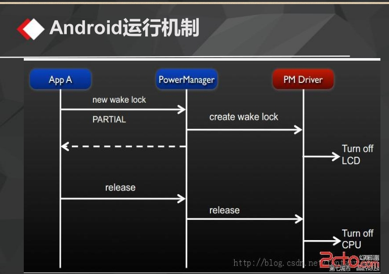
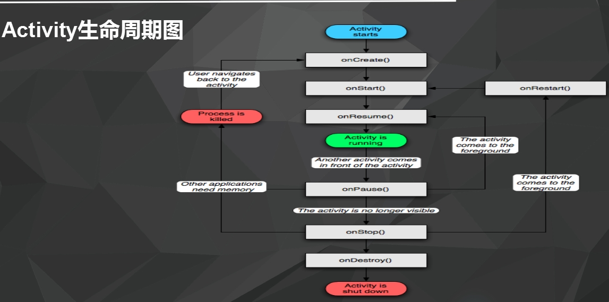

# 2016-10-19日报

* Android基本架构

  * 应用程序层
  * 应用程序架构层
  * 系统运行库层
  * linux核心层

* Android四大组件

  * Activity
  * service(服务)
  * Broadcast Receiver(广播接收器)
  * Content Provider

* Android项目结构

* | src/      | 存放源代码的地方                                 |
  | --------- | ---------------------------------------- |
  | bin/      | 编译后的输出目录，可以找到.apk文件和其他编译后的资源.            |
  | res/      | 包含应用程序的资源，如drawable文件, layout文件, string值. |
  | anim/     | 这里可以放入动画XML文件                            |
  | color/    | 这里可以放入颜色XML文件                            |
  | drawable/ | 这里可以放入位图（PNG,JPEG,GIF）还有9-Patch图片文件，并且也能放置XML文件用来描述Drawable形状和Drawable对象的多种状态切换 |
  | layout/   | 这里可以放入布局XML文件                            |
  | menu/     | 这里可以放入定义菜单的XML文件                         |
  | values/   | 这里可以放入许多种类的XML文件。不同于其他res/目录下的资源。这个文件夹下的XML文件不能由文件名直接引用。但XML文件中的节点可以控制R文件定义的名字。 |
  | raw/      | 这里和assets/差不多都是放入原始的asset文件。但访问的方式与assets/不同。这里必须用R文件来引用，例如如果需要在这里放入一个bg.ogg音频文件，那么请这样调用R.id.bg 。一般来说这里都是放多媒体文件 |

* Android运行机制

  *  


* Android生命周期
  * onCreate(Bundle savedInstanceState)
  * onStart()
  * onRestart()
  * onResume()
  * onPause()
  * onStop()
  * onDestroy()
  * 
  * Activity经历3个阶段：
    * 开始Activity:依次执行onCreate、onStart、onResume
    * Activity重新获得焦点：依次执行onRestart、onStart、onResume
    * 关闭Activity：依次执行onPause、onStop、onDestory

* View组件的布局方式
  * Java代码布局的方式（计算器）
  * XML布局的方式

* 常用ViewGroup子类 五大布局
  * LinearLayout 线性布局
  * FrameLayout 帧布局
  * TableLayout 表格布局
  * AbsoluteLayout 绝对布局
  * RelativeLayout 相对布局

* TextView常用属性
  * android:layout_width=""---控件宽
  * android:layout_height=""---控件高
  * android:layout_weight=""---控件权重
  * android:text=""---控件上的文本内容
  * android:textColor=""---文本颜色
  * android:textSize=""---字体大小

* ImageView常用属性
  * android:layout_width=""---控件宽
  * android:layout_height=""---控件高
  * android:layout_weight=""---控件权重
  * andorid:src   设置图片来源。属性值为android:src="@drawable/图片名称"
  * android:adjustViewBounds    用于设置 ImageView 是否调整自己的边界，来保持所显示图片的长宽比例。属性值为true或false

* Java代码布局——相对布局

* ```
  package com.feicuiedu.android.calculatorjava;

  import android.os.Bundle;
  import android.support.annotation.Nullable;
  import android.support.v7.app.AppCompatActivity;
  import android.widget.Button;
  import android.widget.RelativeLayout;
  import android.widget.TextView;

  /**
   * Created by Administrator on 2016/10/19.
   */

  public class Main extends AppCompatActivity {

      private Button myButton_C;
      //C键
      private Button myButton_CE;
      //CE键
      private Button myButton_Esc;
      //Esc键
      private Button myButton_Add;
      //+键
      private Button myButton_Minus;
      //-键
      private Button myButton_Multiply;
      //*键
      private Button myButton_Divide;
      ///键
      private Button myButton_EqualSign;
      //=键
      private Button myButton_Parenthese;
      //()键
      private Button myButton_Point;
      //.键
      //0~9
      private Button myButton_Zero;
      private Button myButton_One;
      private Button myButton_Two;
      private Button myButton_Three;
      private Button myButton_Four;
      private Button myButton_Five;
      private Button myButton_Six;
      private Button myButton_Seven;
      private Button myButton_Eight;
      private Button myButton_Nine;
      //显示屏
      private TextView mytextview;


      @Override
      protected void onCreate(@Nullable Bundle savedInstanceState) {
          super.onCreate(savedInstanceState);

          //定义20个Button控件
          myButton_C = new Button(this);
          myButton_C.setText("C");
          myButton_CE = new Button(this);
          myButton_CE.setText("CE");
          myButton_Esc = new Button(this);
          myButton_Esc.setText("Esc");
          myButton_Add = new Button(this);
          myButton_Add.setText("+");
          myButton_Minus = new Button(this);
          myButton_Minus.setText("-");
          myButton_Multiply = new Button(this);
          myButton_Multiply.setText("*");
          myButton_Divide = new Button(this);
          myButton_Divide.setText("/");
          myButton_EqualSign = new Button(this);
          myButton_EqualSign.setText("=");
          myButton_Parenthese = new Button(this);
          myButton_Parenthese.setText("()");
          myButton_Point = new Button(this);
          myButton_Point.setText(".");
          myButton_Zero = new Button(this);
          myButton_Zero.setText("0");
          myButton_One = new Button(this);
          myButton_One.setText("1");
          myButton_Two = new Button(this);
          myButton_Two.setText("2");
          myButton_Three = new Button(this);
          myButton_Three.setText("3");
          myButton_Four = new Button(this);
          myButton_Four.setText("4");
          myButton_Five = new Button(this);
          myButton_Five.setText("5");
          myButton_Six = new Button(this);
          myButton_Six.setText("6");
          myButton_Seven = new Button(this);
          myButton_Seven.setText("7");
          myButton_Eight = new Button(this);
          myButton_Eight.setText("8");
          myButton_Nine = new Button(this);
          myButton_Nine.setText("9");
          mytextview = new TextView(this);

          //为空间设置ID
          // (数字1~9,id为1~9;
          // 加减乘除为10~13,=为14;
          // C,CE,Dsc,(),.为15~19；
          // 数字0，id为20
          //显示屏为21
          myButton_Zero.setId(20);
          myButton_One.setId(1);
          myButton_Two.setId(2);
          myButton_Three.setId(3);
          myButton_Four.setId(4);
          myButton_Five.setId(5);
          myButton_Six.setId(6);
          myButton_Seven.setId(7);
          myButton_Eight.setId(8);
          myButton_Nine.setId(9);
          myButton_Add.setId(10);
          myButton_Minus.setId(11);
          myButton_Multiply.setId(12);
          myButton_Divide.setId(13);
          myButton_EqualSign.setId(14);
          myButton_C.setId(15);
          myButton_CE.setId(16);
          myButton_Esc.setId(17);
          myButton_Parenthese.setId(18);
          myButton_Point.setId(19);
          mytextview.setId(21);


          //定义好父容器并设置相关属性(相对布局)
          RelativeLayout myLayout = new RelativeLayout(this);

          //设置TextView的布局参数
          RelativeLayout.LayoutParams mytableParams =
                  new RelativeLayout.LayoutParams(
                          RelativeLayout.LayoutParams.MATCH_PARENT,
                          RelativeLayout.LayoutParams.WRAP_CONTENT
                  );
          mytableParams.addRule(RelativeLayout.ABOVE,myButton_C.getId());

          //设置Button的布局参数

          //15 C
          RelativeLayout.LayoutParams buttonCParams =
                  new RelativeLayout.LayoutParams(
                          RelativeLayout.LayoutParams.WRAP_CONTENT,
                          RelativeLayout.LayoutParams.WRAP_CONTENT
                  );
          buttonCParams.addRule(RelativeLayout.CENTER_VERTICAL);
          //16 CE
          RelativeLayout.LayoutParams buttonCEParams =
                  new RelativeLayout.LayoutParams(
                          RelativeLayout.LayoutParams.WRAP_CONTENT,
                          RelativeLayout.LayoutParams.WRAP_CONTENT
                  );
          buttonCEParams.addRule(RelativeLayout.CENTER_VERTICAL);
          buttonCEParams.addRule(RelativeLayout.RIGHT_OF,myButton_C.getId());
          //17 Esc
          RelativeLayout.LayoutParams buttonEscParams =
                  new RelativeLayout.LayoutParams(
                          RelativeLayout.LayoutParams.WRAP_CONTENT,
                          RelativeLayout.LayoutParams.WRAP_CONTENT
                  );
          buttonEscParams.addRule(RelativeLayout.CENTER_VERTICAL);
          buttonEscParams.addRule(RelativeLayout.RIGHT_OF,myButton_CE.getId());
          //13 /
          RelativeLayout.LayoutParams buttonDivideParams =
                  new RelativeLayout.LayoutParams(
                          RelativeLayout.LayoutParams.WRAP_CONTENT,
                          RelativeLayout.LayoutParams.WRAP_CONTENT
                  );
          buttonDivideParams.addRule(RelativeLayout.CENTER_VERTICAL);
          buttonDivideParams.addRule(RelativeLayout.RIGHT_OF,myButton_Esc.getId());

          //7 7
          RelativeLayout.LayoutParams buttonSevenParams =
                  new RelativeLayout.LayoutParams(
                          RelativeLayout.LayoutParams.WRAP_CONTENT,
                          RelativeLayout.LayoutParams.WRAP_CONTENT
                  );
          buttonSevenParams.addRule(RelativeLayout.BELOW,myButton_C.getId());
          //8 8
          RelativeLayout.LayoutParams buttonEightParams =
                  new RelativeLayout.LayoutParams(
                          RelativeLayout.LayoutParams.WRAP_CONTENT,
                          RelativeLayout.LayoutParams.WRAP_CONTENT
                  );
          buttonEightParams.addRule(RelativeLayout.BELOW,myButton_C.getId());
          buttonEightParams.addRule(RelativeLayout.RIGHT_OF,myButton_Seven.getId());
          //9 9
          RelativeLayout.LayoutParams buttonNineParams =
                  new RelativeLayout.LayoutParams(
                          RelativeLayout.LayoutParams.WRAP_CONTENT,
                          RelativeLayout.LayoutParams.WRAP_CONTENT
                  );
          buttonNineParams.addRule(RelativeLayout.BELOW,myButton_C.getId());
          buttonNineParams.addRule(RelativeLayout.RIGHT_OF,myButton_Eight.getId());
          //12 *
          RelativeLayout.LayoutParams buttonMultiplyParams =
                  new RelativeLayout.LayoutParams(
                          RelativeLayout.LayoutParams.WRAP_CONTENT,
                          RelativeLayout.LayoutParams.WRAP_CONTENT
                  );
          buttonMultiplyParams.addRule(RelativeLayout.BELOW,myButton_C.getId());
          buttonMultiplyParams.addRule(RelativeLayout.RIGHT_OF,myButton_Nine.getId());

          //4 4
          RelativeLayout.LayoutParams buttonFourParams =
                  new RelativeLayout.LayoutParams(
                          RelativeLayout.LayoutParams.WRAP_CONTENT,
                          RelativeLayout.LayoutParams.WRAP_CONTENT
                  );
          buttonFourParams.addRule(RelativeLayout.BELOW,myButton_Seven.getId());
          //5 5
          RelativeLayout.LayoutParams buttonFiveParams =
                  new RelativeLayout.LayoutParams(
                          RelativeLayout.LayoutParams.WRAP_CONTENT,
                          RelativeLayout.LayoutParams.WRAP_CONTENT
                  );
          buttonFiveParams.addRule(RelativeLayout.BELOW,myButton_Seven.getId());
          buttonFiveParams.addRule(RelativeLayout.RIGHT_OF,myButton_Four.getId());
          //6 6
          RelativeLayout.LayoutParams buttonSixParams =
                  new RelativeLayout.LayoutParams(
                          RelativeLayout.LayoutParams.WRAP_CONTENT,
                          RelativeLayout.LayoutParams.WRAP_CONTENT
                  );
          buttonSixParams.addRule(RelativeLayout.BELOW,myButton_Seven.getId());
          buttonSixParams.addRule(RelativeLayout.RIGHT_OF,myButton_Five.getId());
          //10 +
          RelativeLayout.LayoutParams buttonAddParams =
                  new RelativeLayout.LayoutParams(
                          RelativeLayout.LayoutParams.WRAP_CONTENT,
                          RelativeLayout.LayoutParams.WRAP_CONTENT
                  );
          buttonAddParams.addRule(RelativeLayout.BELOW,myButton_Seven.getId());
          buttonAddParams.addRule(RelativeLayout.RIGHT_OF,myButton_Six.getId());

          //1 1
          RelativeLayout.LayoutParams buttonOneParams =
                  new RelativeLayout.LayoutParams(
                          RelativeLayout.LayoutParams.WRAP_CONTENT,
                          RelativeLayout.LayoutParams.WRAP_CONTENT
                  );
          buttonOneParams.addRule(RelativeLayout.BELOW,myButton_Four.getId());
          //2 2
          RelativeLayout.LayoutParams buttonTwoParams =
                  new RelativeLayout.LayoutParams(
                          RelativeLayout.LayoutParams.WRAP_CONTENT,
                          RelativeLayout.LayoutParams.WRAP_CONTENT
                  );
          buttonTwoParams.addRule(RelativeLayout.BELOW,myButton_Four.getId());
          buttonTwoParams.addRule(RelativeLayout.RIGHT_OF,myButton_One.getId());
          //3 3
          RelativeLayout.LayoutParams buttonThreeParams =
                  new RelativeLayout.LayoutParams(
                          RelativeLayout.LayoutParams.WRAP_CONTENT,
                          RelativeLayout.LayoutParams.WRAP_CONTENT
                  );
          buttonThreeParams.addRule(RelativeLayout.BELOW,myButton_Four.getId());
          buttonThreeParams.addRule(RelativeLayout.RIGHT_OF,myButton_Two.getId());
          //11 -
          RelativeLayout.LayoutParams buttonMinusParams =
                  new RelativeLayout.LayoutParams(
                          RelativeLayout.LayoutParams.WRAP_CONTENT,
                          RelativeLayout.LayoutParams.WRAP_CONTENT
                  );
          buttonMinusParams.addRule(RelativeLayout.BELOW,myButton_Four.getId());
          buttonMinusParams.addRule(RelativeLayout.RIGHT_OF,myButton_Three.getId());

          //18 ()
          RelativeLayout.LayoutParams buttonParentheseParams =
                  new RelativeLayout.LayoutParams(
                          RelativeLayout.LayoutParams.WRAP_CONTENT,
                          RelativeLayout.LayoutParams.WRAP_CONTENT
                  );
          buttonParentheseParams.addRule(RelativeLayout.BELOW,myButton_One.getId());
          //0 0
          RelativeLayout.LayoutParams buttonZeroParams =
                  new RelativeLayout.LayoutParams(
                       RelativeLayout.LayoutParams.WRAP_CONTENT,
                          RelativeLayout.LayoutParams.WRAP_CONTENT
                  );
          buttonZeroParams.addRule(RelativeLayout.BELOW,myButton_Two.getId());
          buttonZeroParams.addRule(RelativeLayout.RIGHT_OF,myButton_Parenthese.getId());
          //19 .
          RelativeLayout.LayoutParams buttonPointParams =
                  new RelativeLayout.LayoutParams(
                          RelativeLayout.LayoutParams.WRAP_CONTENT,
                          RelativeLayout.LayoutParams.WRAP_CONTENT
                  );
          buttonPointParams.addRule(RelativeLayout.BELOW,myButton_One.getId());
          buttonPointParams.addRule(RelativeLayout.RIGHT_OF,myButton_Zero.getId());
          //14 =
          RelativeLayout.LayoutParams buttonEqualSignParams =
                  new RelativeLayout.LayoutParams(
                          RelativeLayout.LayoutParams.WRAP_CONTENT,
                          RelativeLayout.LayoutParams.WRAP_CONTENT
                  );
          buttonEqualSignParams.addRule(RelativeLayout.BELOW,myButton_Minus.getId());
          buttonEqualSignParams.addRule(RelativeLayout.RIGHT_OF,myButton_Point.getId());


          //将布局添加到父容器中,按照控件的顺序

          myLayout.addView(myButton_C,buttonCParams);
          myLayout.addView(mytextview,mytableParams);
          myLayout.addView(myButton_CE,buttonCEParams);
          myLayout.addView(myButton_Esc,buttonEscParams);
          myLayout.addView(myButton_Divide,buttonDivideParams);
          myLayout.addView(myButton_Seven,buttonSevenParams);
          myLayout.addView(myButton_Eight,buttonEightParams);
          myLayout.addView(myButton_Nine,buttonNineParams);
          myLayout.addView(myButton_Multiply,buttonMultiplyParams);
          myLayout.addView(myButton_Four,buttonFourParams);
          myLayout.addView(myButton_Five,buttonFiveParams);
          myLayout.addView(myButton_Six,buttonSixParams);
          myLayout.addView(myButton_Add,buttonAddParams);
          myLayout.addView(myButton_One,buttonOneParams);
          myLayout.addView(myButton_Two,buttonTwoParams);
          myLayout.addView(myButton_Three,buttonThreeParams);
          myLayout.addView(myButton_Minus,buttonMinusParams);
          myLayout.addView(myButton_Parenthese,buttonParentheseParams);
          myLayout.addView(myButton_Zero,buttonZeroParams);
          myLayout.addView(myButton_Point,buttonPointParams);
          myLayout.addView(myButton_EqualSign,buttonEqualSignParams);


          //设置显示父容器
          setContentView(myLayout);


      }
  }
  ```