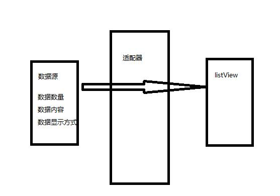

# 20161020日报

* Intent(意图)——完成跳转

  * 显示跳转

    * //声明并初始化一个意图
      Intent intent = new Intent();
      //设置跳转从MainActivity跳转到SecondActivity
      intent.setClass(MainActivity.this, SecondActivity.class);
      //启动这个意图
      startActivity(intent);

  * 隐式跳转

    * //声明并初始化一个意图
      Intent intent = new Intent();
      //通过设置跳转动作（action） 跳转到打电话界面
      intent.setAction(android.intent.action.SECOND);
      //启动这个意图
      startActivity(intent);

    * 隐式Intent传递的特点

      * 没有明确的目标组件名称
      * 利用Intent Filter过滤器选择要跳转页面

    * 自定义隐式Intent

      * <activity

        ​	//目标Activity

        ​	android:name = "com.example.clouddemo.SecondActivity"

        ​	android:label = "@string/title_activity_second">

        ​	<intent-filter>

        ​		//操作名称

        ​		<action android:name = "android.intent.action.SECOND"/>

        ​		//操作类型

        ​		<category android:name = "android.intent.category.DEFAULT"/>

        ​	</intent-filter>

* ListView

  * 列表组件（ListView）在使用时，需要提供如下数据

    * 需要显示的数据数量
    * 需要显示的数据内容
    * 需要显示的数据显示方式
    * 并通过Adpater（适配器），传递给Listview组件

    

  * ListView在绘制的过程中主要分如下2步

    * 调用getCount方法来获取Item的个数循环
    * 调用getView方法绘制每个Item

  * 代码

  * ```
    package com.feicuiedu.android.listviewdemo;

    import android.os.Bundle;
    import android.support.annotation.Nullable;
    import android.support.v7.app.AppCompatActivity;
    import android.view.View;
    import android.view.ViewGroup;
    import android.widget.AdapterView;
    import android.widget.BaseAdapter;
    import android.widget.ListView;
    import android.widget.TextView;
    import android.widget.Toast;

    import java.util.ArrayList;
    import java.util.HashMap;
    import java.util.List;
    import java.util.Map;

    /**
     * Created by chenyan on 2016/10/20.
     */

    public class MainAcitivity extends AppCompatActivity {

        private ListView listView1;
        private List<Map<String,String>> list;

        @Override
        protected void onCreate(@Nullable Bundle savedInstanceState) {
            super.onCreate(savedInstanceState);
            setContentView(R.layout.main_layout);

            listView1 = (ListView) findViewById(R.id.listView1);
            list = getData();

            // 绑定适配器
            listView1.setAdapter(baseAdapter);

            // 监听事件
            listView1.setOnItemClickListener(oicl);
        }

        private AdapterView.OnItemClickListener oicl = new AdapterView.OnItemClickListener() {
            @Override
            public void onItemClick(AdapterView<?> parent, View view, int position, long id) {
                Toast.makeText(MainAcitivity.this,"position="+position+",id="+id,Toast.LENGTH_LONG).show();
            }
        };

        private List<Map<String,String>> getData() {

            List<Map<String,String>> tmp = new ArrayList<Map<String,String>>();

            for (int i = 0; i < 20; i++) {
                Map<String,String> map = new HashMap<String,String>();
                map.put("id",i+"");
                map.put("createDate","2016-10-"+i);
                map.put("name","2016-10-"+i+"日报");
                tmp.add(map);
            }

            return tmp;
        }

        private BaseAdapter baseAdapter = new BaseAdapter() {

            // 定义数据的个数
            @Override
            public int getCount() {
                return list.size();
            }

            // 定义每行数据的对象
            @Override
            public Map<String,String> getItem(int position) {
                return list.get(position);
            }

            // 定义每行的id值
            @Override
            public long getItemId(int position) {
                return position;
            }

            // 定义每行都 是什么样的布局,如何展示数据
            @Override
            public View getView(int position, View convertView, ViewGroup parent) {
                Map<String,String> tmpMap = getItem(position);

                String id = tmpMap.get("id");
                String createDate = tmpMap.get("createDate");
                String name = tmpMap.get("name");


                View view = getLayoutInflater().inflate(R.layout.main_item_layout,null);

                TextView tvId = (TextView) view.findViewById(R.id.tvId);
                TextView tvName= (TextView) view.findViewById(R.id.tvName);
                TextView tvDate = (TextView) view.findViewById(R.id.tvDate);

                tvId.setText(id);
                tvDate.setText(createDate);
                tvName.setText(name);

                return view;
            }
        };


    }
    ```